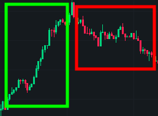

# brainjs-cryptocurrency-trend

> Cryptocurrency ML price prediction. Ready for connection to any crypto exchange to trade with limit orders


## Usage

**1. Disable CORS in your browser**

> Windows

```bat
"C:\Program Files\Google\Chrome\Application\chrome.exe" --disable-web-security --disable-gpu --user-data-dir=%LOCALAPPDATA%\Google\chromeTemp
```

> macOS

```bash
open -n -a /Applications/Google\ Chrome.app/Contents/MacOS/Google\ Chrome --args --user-data-dir="/tmp/chrome_dev_test" --disable-web-security
```

> Linux

```bash
google-chrome --disable-web-security
```

**2. Start this app**

```bash
npm install
npm start
```

**3. Configure the neural network. If you can't just press save button, default config is good enough**

**4. Wait for whales patterns interception. Open Chrome Dev Tools for detailed log**

**5. Enjoy! Search for `TODO: implement` in this app to find a part for order creation integration**

## How it is made

The bot is observing `HIGH` values on the `1M` candle chart of the crypto exchange. It is trying to collect market whale patterns to detect them and predict price change.



To do that It listening the exchange `1M` candle websocket until It finds a spike or a space between two spikes. From the technical side it combines values by groups with 100 records (each message per 250ms) and [uses linear regression to compute slope](https://stackoverflow.com/questions/6195335/linear-regression-in-javascript).


The sign of Slope variable means the trend: negative (`red rect`) if price is going downward or positive (`green rect`) if price is going forward. So when the bot see the pair of groups with trend `[-1, 1]` or `[1, -1]` it capture them and start training neural network


The neural net takes only the last 10 prices from a market as an input and 2 values as an output. If the price rises, it will return `[1, 0]`. If the price will fail it returns `[0, 1]`


To use a group with 100 price records as a set for training I am using [stride tricks](https://developers.google.com/machine-learning/practica/image-classification/convolutional-neural-networks). That helps me emulate receiving last 10 values from a websocket as It works in real time. But as I am already known the trend, the training of neural network is easy peasy (check `green`, `violet`, `yellow`, `green` rects)


FYN If you have your own DAU which have more than `10 000$` for trading feel free to contact me, I got a lot of solutions of that kind for crypto currencies
